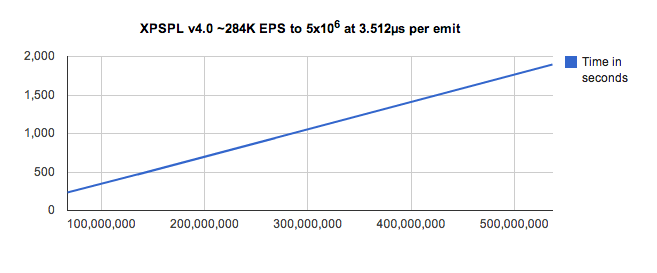

.. prggmr documentation master file, created by
   sphinx-quickstart on Wed Dec 19 20:57:45 2012.

XPSPL - PHP Signal and Event Library.
=====================================

Made in `Orlando
<http://orlandote.ch>`_.

Table of Contents
-----------------

.. toctree::
   :maxdepth: 2
   :glob:

   *

.. contents::

API
---

All API functions are non-namespaced, globally available.

.. toctree::
   :maxdepth: 1
   :glob:

   api/*

Modules
-------

XPSPL Bundled modules.

.. toctree::
   :maxdepth: 1

   modules/ftp

Source
------

XPSPL is hosted on `Github
<https://github.com/prggmr/XPSPL>`_.

Support
-------

Have an issue?

File a bug report in `Github issues
<https://github.com/prggmr/XPSPL/issues>`_.

Performance
-----------

Performance testing using a 2.0 GHz Intel Core 2 Duo.

Demonstrating a linear signal emit performance.

Performance Tests
%%%%%%%%%%%%%%%%%

.. code-block:: php

   --------------------------------------
   Total tests performed 5,242,800
   --------------------------------------
   Average Processes Installed - 0.0009126066 seconds
   Tests Performed : 1,310,700
   --------------------------------------
   --------------------------------------
   Average Signals Emitted - 0.0001160003 seconds
   Tests Performed : 1,310,700
   --------------------------------------
   --------------------------------------
   Average Signal Registration - 0.0003996142 seconds
   Tests Performed : 1,310,700
   --------------------------------------
   --------------------------------------
   Average Loops Performed - 0.0003038336 seconds
   Tests Performed : 1,310,700
   --------------------------------------

Author
------

XPSPL has been designed and developed by `Nickolas Whiting
<https://plus.google.com/103257674267659844067?rel=author>`_.

XPSPL Internal Source
---------------------

The core classes and functions of XPSPL.

.. toctree::
   :maxdepth: 1
   :glob:

   XPSPL/*
   XPSPL/*/*
