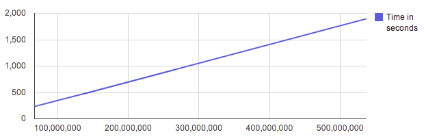

.. prggmr documentation master file, created by
   sphinx-quickstart on Wed Dec 19 20:57:45 2012.

XPSPL - PHP Signal and Event Library.
=====================================

XPSPL is a high-performance event loop for PHP that supports the following
event types.

* Signals
* Timers
* CRON Timers
* Asynchronous Network I/O
* Complex Signals
* Idle

The best way to think of XPSPL is as a libevent and libev library only written
in PHP.

Table of Contents
-----------------

.. toctree::
   :maxdepth: 1
   :glob:

   *

Modules
-------

XPSPL Bundled modules.

.. toctree::
   :maxdepth: 2

   modules/ftp
   modules/time

Source
------

XPSPL is hosted on `Github
<https://github.com/prggmr/XPSPL>`_.

Support
-------

Have an issue?

File a bug report in `Github issues
<https://github.com/prggmr/XPSPL/issues>`_.

Performance
-----------

Performance testing on a 3.2 GHz Intel i5.

Demonstrating a linear signal emit performance.

Performance Tests
%%%%%%%%%%%%%%%%%

.. code-block:: php

    Installation SIG Process Performance Test
    Tests Performed : 204601
    Average Time Spent : 0.0000093658
    --------------------------------------
    Emitting a signal Performance Test
    Tests Performed : 204601
    Average Time Spent : 0.0000031479
    --------------------------------------
    Registering a signal Performance Test
    Tests Performed : 204601
    Average Time Spent : 0.0000024548
    --------------------------------------
    Event Loop Performance Test
    Tests Performed : 204601
    Average Time Spent : 0.0000109978
    --------------------------------------

Author
------

XPSPL is designed and developed by `Nickolas Whiting
<https://plus.google.com/103257674267659844067?rel=author>`_.
